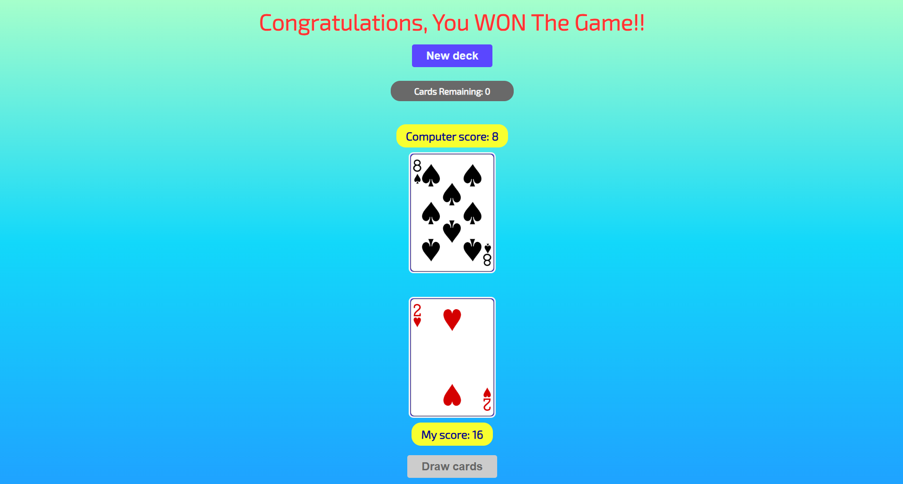

# Card Games — War (Simple JS Card Game)



<!-- Replace ./assets/screenshot.png with your image file. Recommended size: 1280×720 or 800×450. You can also use a GIF to show gameplay (e.g. ./assets/demo.gif) -->

## Overview

A small browser-based card game that uses the [Deck of Cards API](https://deckofcardsapi.com/) (via Scrimba proxy) to draw cards and compare their values. Each round two cards are drawn: one for the computer and one for the player. Higher card wins the round and earns a point. Game ends when the deck is empty.

This repo contains a minimal HTML/CSS/JavaScript implementation — perfect for learning DOM manipulation, fetch API, and game logic.

---

## Features

- Create a new shuffled deck
- Draw two cards (computer vs player)
- Display card images
- Track and display scores
- Disable draw button when deck is empty and show final winner
- Simple, easy-to-read code — great for beginners

---

## Demo

Open `index.html` in your browser or serve the folder with a static server (Live Server, http-server, etc.).

---

## How to run

1. Clone the repo:

```bash
git clone https://github.com/<your-username>/<repo-name>.git
cd <repo-name>
```

2. Open `index.html` in your browser, or run a lightweight server (recommended for consistent behavior):

```bash
# using npm http-server
npx http-server .
# or using Live Server extension in VS Code
```

3. Click **New Deck** to shuffle and create a deck, then click **Draw Cards** to play.

---

## Code (main flow)

Place the following JS in a script file (e.g. `script.js`) and include it in `index.html`:

```js
let deckId;
let computerScore = 0;
let myScore = 0;
const cardsContainer = document.getElementById('cards');
const newDeckBtn = document.getElementById('new-deck');
const drawCardBtn = document.getElementById('draw-cards');
const header = document.getElementById('header');
const remainingText = document.getElementById('remaining');
const computerScoreEl = document.getElementById('computer-score');
const myScoreEl = document.getElementById('my-score');

function handleClick() {
  fetch('https://apis.scrimba.com/deckofcards/api/deck/new/shuffle/')
    .then((res) => res.json())
    .then((data) => {
      remainingText.textContent = `Remaining cards: ${data.remaining}`;
      deckId = data.deck_id;
      console.log(deckId);
    });
}

newDeckBtn.addEventListener('click', handleClick);

drawCardBtn.addEventListener('click', () => {
  fetch(`https://apis.scrimba.com/deckofcards/api/deck/${deckId}/draw/?count=2`)
    .then((res) => res.json())
    .then((data) => {
      remainingText.textContent = `Remaining cards: ${data.remaining}`;
      cardsContainer.children[0].innerHTML = `\n                \n            `;
      cardsContainer.children[1].innerHTML = `\n                \n            `;
      const winnerText = determineCardWinner(data.cards[0], data.cards[1]);
      header.textContent = winnerText;

      if (data.remaining === 0) {
        drawCardBtn.disabled = true;
        if (computerScore > myScore) {
          header.textContent = 'The computer won the game!';
        } else if (myScore > computerScore) {
          header.textContent = 'You won the game!';
        } else {
          header.textContent = "It's a tie game!";
        }
      }
    });
});

function determineCardWinner(card1, card2) {
  const valueOptions = [
    '2',
    '3',
    '4',
    '5',
    '6',
    '7',
    '8',
    '9',
    '10',
    'JACK',
    'QUEEN',
    'KING',
    'ACE',
  ];
  const card1ValueIndex = valueOptions.indexOf(card1.value);
  const card2ValueIndex = valueOptions.indexOf(card2.value);

  if (card1ValueIndex > card2ValueIndex) {
    computerScore++;
    computerScoreEl.textContent = `Computer score: ${computerScore}`;
    return 'Computer wins!';
  } else if (card1ValueIndex < card2ValueIndex) {
    myScore++;
    myScoreEl.textContent = `My score: ${myScore}`;
    return 'You win!';
  } else {
    return 'War!';
  }
}
```

---

## Project structure

```
/ (root)
├─ index.html
├─ script.js
├─ styles.css
├─ assets/
│  └─ screenshot.png  <-- place your screenshot here
└─ README.md
```

---

## Customization ideas

- Add animations for card flips
- Add sound effects for wins/losses
- Implement the full War rules (handle ties by drawing extra cards)
- Add difficulty modes or multiple rounds

---

## Credits

- Uses the Deck of Cards API via Scrimba: `https://apis.scrimba.com/deckofcards`.

---

## License

MIT © Your Name
